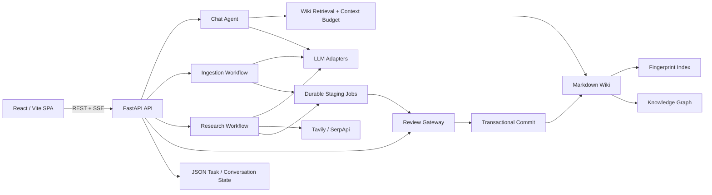

# WikiForge Agents 项目面试手册

> 仓库名称：`llmwiki`  
> 面试项目名：**WikiForge Agents — 本地优先的智能知识库系统**  
> 项目定位：Local-first Agentic Knowledge Engine  
> 技术栈：React + TypeScript + Vite + FastAPI + Markdown/JSON + SSE

## 1. 一句话介绍

WikiForge Agents 是一个本地优先的智能知识库系统，通过对话、文档摄入、深度研究和人工审阅，把非结构化资料持续转化为可编辑、可检索、可追溯的 Markdown Wiki 与知识图谱。

它并不是简单的“上传文档后聊天”，而是围绕长期知识记忆构建了一条完整链路：

```text
信息获取 → 知识召回 → 模型推理 → 页面生成 → 人工确认 → 可靠写入 → 索引与图谱更新
```

## 2. 30 秒面试介绍

我设计并实现了一个本地优先的智能知识库系统。它可以把 PDF、Word、PPT、Markdown 等文档，通过两阶段摄入流程生成 8 类结构化 Wiki 页面，并自动维护页面引用关系和知识图谱。

对话模块不是把全部文档直接塞给模型，而是使用动态上下文预算、倒排索引、混合检索和一跳 WikiLink 扩展来组织上下文。为了在不引入数据库的情况下保证可靠性，我实现了多页面快照回滚和单文件 `fsync + atomic replace` 两层写入机制。系统还具备持久化任务、重启恢复、人工审阅和深度研究能力。

在 10,000 页本地合成数据测试中，冷索引构建约 1.33 秒，图谱构建约 3.32 秒，热检索 P50 约 165 毫秒。

## 3. 两分钟项目介绍

项目要解决的问题是：个人资料通常分散在 PDF、Word、Markdown 和网页中，普通 RAG 虽然可以回答问题，但不会真正形成可以持续维护的知识结构；纯自动 Agent 又容易把错误内容直接写入长期记忆。

因此我把系统拆成四类智能工作流：

1. **对话工作流**：根据问题召回 Wiki 页面，沿知识图谱扩展相关内容，在模型窗口预算内生成带引用的流式回答。
2. **摄入工作流**：先理解文档，再规划并生成不同类型的 Wiki 页面；生成结果先进入暂存区，用户确认后才写入知识库。
3. **研究工作流**：通过搜索服务获取外部来源，抓取正文并绑定稳定引用编号，再生成有证据支撑的研究页面。
4. **审阅工作流**：把重复页面、知识冲突、缺失页面和研究建议转化为明确的人工决策任务。

我没有引入数据库、Redis 或通用 Agent 框架，而是采用 Markdown/JSON 作为唯一事实来源，用确定性的状态机控制 LLM 的输入、输出、重试和提交边界。这样既保留了文件可直接编辑、可迁移的优势，又避免模型自由执行带来的不可控性。

## 4. 项目架构



架构边界：

- React/Vite 负责交互、流式状态、Wiki 编辑与图谱展示。
- FastAPI 负责 API、任务编排、模型适配、文件解析和存储一致性。
- Markdown 保存知识正文，YAML Frontmatter 保存页面元数据。
- JSON 保存项目索引、对话、任务、设置和审阅状态。
- 内存索引和图谱缓存只是可重建的加速层，磁盘文件始终是事实来源。
- Docker 部署时由 Nginx 提供 SPA 和同源 API 代理，并关闭 SSE 代理缓冲。

详细架构见 [ARCHITECTURE.md](./ARCHITECTURE.md)。

## 5. 为什么选择这套技术栈

### 5.1 为什么选择 React + TypeScript + Vite

项目的前端核心是流式对话、任务状态、Wiki 编辑和图谱交互，本质上是一个状态密集型 SPA，不依赖 SEO 和服务端渲染。

选择理由：

- React 适合拆分对话、摄入、审阅、图谱和设置等独立交互区域。
- TypeScript 可以约束 SSE 事件、API 数据和任务状态，减少前后端协议漂移。
- Vite 启动和热更新速度快，适合本地优先工具的开发模式。
- 通过路由级懒加载拆分摄入、研究、图谱等重型页面，降低首屏负担。
- React 生态中已有成熟的 Markdown 渲染和 Force Graph 组件。

为什么没有继续使用 Next.js：

- 当前产品没有 SEO、SSR 或服务端 React 的核心需求。
- FastAPI 已经承担后端职责，再保留 Next.js Server Runtime 会形成重复边界。
- Vite SPA + FastAPI 的部署和调用链更直接，排障成本更低。

对应实现：[App.tsx](../frontend/src/App.tsx)、[api.ts](../frontend/src/lib/api.ts)。

### 5.2 为什么选择 FastAPI + Pydantic

选择理由：

- 项目包含 PDF、Word、PPT 解析和 LLM 调用，Python 生态更完整。
- FastAPI 原生支持异步请求、StreamingResponse 和依赖注入，适合 SSE 与项目级 Store 注入。
- Pydantic 为设置、请求体和任务操作提供明确的数据校验。
- API 层较薄，领域逻辑可以放在 Agent、Pipeline 和 Store 中，便于测试。

为什么没有选择纯 Node.js 后端：

- Python 在文档处理、LLM SDK 和文本分析方面更成熟。
- 前后端使用不同语言增加了一点协议成本，但通过统一 API 类型和测试可以控制。

对应实现：[main.py](../backend/app/main.py)、[chat.py](../backend/app/api/chat.py)。

### 5.3 为什么选择 Markdown + JSON，而不是数据库

这是项目最重要的技术选择。

选择理由：

- Markdown 对用户透明，可以直接阅读、编辑、备份和迁移。
- YAML Frontmatter 适合保存页面类型、标签、来源和关联页面。
- 文件天然适合本地优先、单用户和 Git 管理场景。
- 数据导入导出不依赖数据库版本或迁移脚本。
- 即使应用停止，知识内容仍然可用，不会被锁在专有格式里。

代价：

- 无法依赖数据库事务，只能自行实现锁、原子替换和批量回滚。
- 多进程共享写入比较困难，目前只保证单 Uvicorn 进程内的并发安全。
- 页面规模继续增大后，目录扫描和复杂查询会成为瓶颈。

为什么这个权衡合理：

- 项目目标是可信本机单用户和约 10,000 页规模，而不是公网多租户 SaaS。
- 在这一规模下，文件的可解释性和可迁移性比数据库的复杂查询能力更重要。

对应实现：[file_store.py](../backend/app/storage/file_store.py)、[wiki_store.py](../backend/app/storage/wiki_store.py)。

### 5.4 为什么选择 SSE，而不是 WebSocket

系统主要需要服务器向浏览器持续推送：

- 模型推理内容
- 回答正文
- 引用与下一步选项
- 摄入与研究进度
- 完成或错误事件

这些都是典型的单向流式场景。SSE 的优势是：

- 基于普通 HTTP，基础设施和调试工具更简单。
- 更容易经过 Nginx 代理。
- 不需要维护双向长连接协议和心跳状态。
- 可以自然定义 `reasoning`、`chunk`、`references`、`progress`、`done`、`error` 等事件。

如果未来需要多人实时协作、双向编辑或在线状态同步，再考虑 WebSocket。

### 5.5 为什么没有引入向量数据库

当前检索目标主要是中文 Wiki 标题、术语和页面正文，页面规模约为单机 10,000 页。因此先采用：

- 中文 bigram
- 英文 token
- 标题/正文倒排索引
- 标题权重
- 字符级相似度
- WikiLink 邻居扩展

这样可以做到：

- 完全本地运行，不增加 Embedding API 成本。
- 不引入额外服务和索引一致性问题。
- 检索结果容易解释，可以说明是标题命中、正文命中还是图谱邻居。

局限是语义同义召回能力弱于向量检索。未来可以增加可选 Embedding 索引，与现有 lexical score 做融合，而不是直接替换当前检索。

### 5.6 为什么没有使用 LangGraph 等通用 Agent 框架

项目更关注可控性，而不是追求完全自治。

当前采用的是：

> 确定性编排负责流程与副作用，LLM 负责语义理解与内容生成。

具体表现：

- 程序控制任务状态和合法状态迁移。
- 程序控制上下文预算和召回数量。
- 模型只能通过 FILE/REVIEW 等受限协议提交提案。
- 所有长期记忆写入必须经过人工确认。
- 文件操作由 Store 完成，模型无法直接访问任意路径。

这种方式比通用 Agent 框架少了一些灵活性，但更容易测试、恢复和解释。后续如果任务分支和工具调用显著增加，再评估引入图编排框架。

### 5.7 为什么同时支持 OpenAI-compatible 和 Anthropic Messages

不同模型服务的请求体、鉴权和流式事件格式并不相同。如果业务代码直接依赖某个 Provider，聊天、摄入、研究和图片理解都会被绑定。

因此系统把差异封装在 LLM Adapter 中，并统一为内部的内容流和推理流：

```text
OpenAI-compatible ─┐
                   ├─→ reasoning / content → Agent Workflow
Anthropic Messages ┘
```

这样设置页连接测试、普通请求、流式对话和多模态请求可以复用同一配置解析逻辑。

对应实现：[llm.py](../backend/app/llm.py)。

## 6. Agent 工作流设计

系统不是多个 Agent 自由对话，而是多个有明确职责和权限边界的智能工作流。

### 6.1 Chat Agent

```text
用户问题
  → Wiki 召回
  → 一跳关系扩展
  → 上下文预算分配
  → 模型流式推理
  → 回答、引用和选项
  → 完整成功后持久化一轮消息
```

Chat Agent 组合了四类记忆：

| 记忆类型 | 实现 |
| --- | --- |
| 工作记忆 | 当前问题、System Prompt、召回页面 |
| 短期记忆 | 最近对话及字符预算裁剪 |
| 长期记忆 | Markdown Wiki 与历史对话 |
| 用户记忆 | 学习风格、认知模式和知识水平 |

关键可靠性语义：

- 新对话先生成候选 ID，不提前创建空对话。
- 上游空响应、流中断、客户端取消和落盘失败均不提交消息。
- `done` 表示完整回答已经成功持久化，而不仅是模型停止生成。

对应实现：[chat_agent.py](../backend/app/agents/chat_agent.py)、[chat.py](../backend/app/api/chat.py)。

### 6.2 Ingestion Workflow

摄入不是单次摘要，而是一个知识编译过程：

```text
Raw Document
  → Parse
  → SHA-256 Cache Check
  → Image Extraction / Caption
  → Semantic Analysis
  → Typed Page Planning
  → FILE / REVIEW Parsing
  → Staging
  → Human Review
  → Transactional Commit
```

采用两阶段生成：

1. 分析阶段识别实体、概念、论点、证据、矛盾和开放问题。
2. 生成阶段根据分析结果与已有 Wiki Index 输出页面提案。

支持 8 类 Wiki 页面：

- entity
- concept
- source
- comparison
- synthesis
- finding
- thesis
- methodology

生成结果进入持久化暂存任务，用户可以：

- 逐页选择
- 修改 Markdown
- 选择合并或覆盖
- 接受或拒绝
- 提供反馈重新生成

对应实现：[pipeline.py](../backend/app/ingest/pipeline.py)、[prompts.py](../backend/app/ingest/prompts.py)、[ingest.py](../backend/app/api/ingest.py)。

### 6.3 Research Workflow

Deep Research 负责补充 Wiki 缺口，而不是让模型在没有来源时自由生成。

流程包括：

1. 根据主题生成或接收搜索词。
2. 调用 Tavily 或 SerpApi。
3. 对 URL 做规范化和去重。
4. 校验 DNS 与目标地址，拒绝私网、本机和保留地址。
5. 抓取公开网页正文。
6. 将来源绑定为稳定的 `[S1]`、`[S2]` 引用。
7. 基于证据综合结论并生成 Wiki 提案。
8. 进入人工审阅，接受后才写入 Wiki。

搜索未配置、搜索结果为空或全部来源不可用时，任务会失败关闭，不允许无证据生成。

对应实现：[deep_research.py](../backend/app/research/deep_research.py)、[research.py](../backend/app/api/research.py)。

### 6.4 Review Gateway

模型无法可靠自动决定的内容会转化为审阅项：

- contradiction：新知识与现有页面冲突
- duplicate：可能存在重复或同义页面
- missing-page：重要概念缺少独立页面
- suggestion：值得继续研究的方向

用户可以创建页面、合并页面、手动解决、发起深度研究或跳过。Review Gateway 是 Agent 与长期记忆之间的权限边界。

## 7. 核心实现一：动态上下文预算与 Wiki 召回

### 7.1 为什么需要预算分配器

简单 RAG 常见的问题是：召回页面过多会挤掉历史消息和回答空间；单个超长页面也可能占满模型窗口。

项目按模型 `context_window` 定义预算策略：

| 内容 | 比例 |
| --- | ---: |
| Wiki Index 预留 | 5% |
| 召回页面 | 50% |
| System Prompt 与历史 | 约 30% |
| 回复预留 | 15% |

未配置模型窗口时使用保守的 32,768 字符。单页最大长度取页面预算的 30%，同时设置 5,000 字符下限。

当前 Chat 路径实际执行的约束包括：

- 页面总预算
- 单页最大长度
- 回复预留
- 最近 20 条历史消息
- 历史字符总预算

对应实现：[context_budget.py](../backend/app/wiki/context_budget.py)。

### 7.2 召回流程

1. 对查询执行英文 token 与中文 bigram 分词。
2. 从标题和正文倒排表获取候选集合。
3. 标题命中加 3 分，正文命中加 1 分。
4. 可选 Hybrid 模式叠加字符 Dice 相似度。
5. 取直接命中页面，受 `page_budget` 限制。
6. 从每个页面提取最多 3 个 WikiLink 邻居。
7. 邻居页面最多使用直接页面一半的单页预算。
8. 将最终页面和路径转换为模型上下文与前端 References。

这个设计比纯向量检索更可解释，也充分利用了用户已经维护的 WikiLink 结构。

## 8. 核心实现二：文件指纹与增量索引

为了允许用户直接用编辑器修改 Markdown，索引不能只依赖应用内部事件。

系统为每个页面保存：

```text
relative path → (mtime_ns, file size)
```

每次访问时比较当前文件指纹：

- 新增页面：解析并加入缓存与倒排索引。
- 修改页面：删除旧 token，再解析新内容。
- 删除页面：清除页面缓存与倒排表引用。
- 无变化页面：复用 Frontmatter、正文和 token 缓存。

应用内部写入会立即失效对应页面；外部编辑则在下一次访问时通过指纹发现。任何页面变化都会增加 generation，并使图谱缓存失效。

优点：Markdown 始终是事实来源，内存状态可以随时重建。  
代价：当前仍需遍历文件并执行 `stat`，因此热请求不是严格的 O(1)。

对应实现：[wiki_store.py](../backend/app/storage/wiki_store.py)。

## 9. 核心实现三：两层写入可靠性

### 9.1 第一层：多页面逻辑事务

摄入可能一次生成多个页面。如果第三个页面写入失败，前两个页面不能留在半完成状态。

`commit_pages()` 的处理流程：

1. 在第一笔写入前校验所有页面路径。
2. 对所有目标文件保存 byte-level snapshot。
3. 对已有页面创建历史版本。
4. 依次执行合并或覆盖。
5. 任意步骤失败时恢复全部目标快照。
6. 全部成功后统一失效相关索引和图谱缓存。

这不是数据库意义上的 ACID 事务，而是单进程文件系统上的 best-effort logical transaction。面试时应明确这个边界。

### 9.2 第二层：单文件崩溃一致性

Markdown 和 JSON 的单文件写入采用：

```text
创建同目录临时文件
  → 写入完整内容
  → flush
  → fsync
  → os.replace
```

这样可以防止进程在写到一半时留下损坏文件。发生异常时清理临时文件，旧文件保持不变。

JSON 的 read-modify-write 还持有进程内路径锁，避免并发任务读取同一旧版本后互相覆盖。

对应实现：[wiki_store.py](../backend/app/storage/wiki_store.py)、[file_store.py](../backend/app/storage/file_store.py)。

## 10. 核心实现四：知识图谱生成

图谱节点来自 Wiki 页面，边来自：

- 正文中的 `[[WikiLink]]`
- Frontmatter 的 `related` 字段

构建过程：

1. 收集页面标题、类型、标签、来源和正文。
2. 建立标题与文件名到节点 ID 的映射。
3. 解析 WikiLink 和 related 关系。
4. 去除自环和重复无向边。
5. 计算入度、出度与节点连接数。
6. 根据共同邻居和连接结构计算边权重。
7. 执行加权社区发现。
8. 计算意外连接和知识缺口。

图谱使用 generation-based cache。只要页面集合和指纹未变化，就复用同一份图谱结果，Graph Insights 也基于该结果继续计算。

## 11. 实现效果与数据

### 11.1 当前示例知识库

| 指标 | 结果 |
| --- | ---: |
| Wiki 页面 | 47 |
| 图谱节点 | 47 |
| 去重关系边 | 197 |
| 平均节点度 | 约 8.38 |
| 最大节点连接数 | 60 |

### 11.2 10,000 页本机临时合成基准

| 指标 | 结果 |
| --- | ---: |
| 冷索引构建 | 1.33 s |
| 热检索 P50 | 165 ms |
| 热检索 P95 | 185 ms |
| 冷图谱构建 | 3.32 s |
| 图谱缓存请求 | 164 ms |
| 单页外部修改发现 | 159 ms |
| 图谱规模 | 10,000 nodes / 10,000 edges |

说明：

- 数据来自当前开发机、单进程和临时合成数据，不是生产 SLA。
- 图谱缓存请求仍包含 10,000 个文件的指纹校验，但不会重新计算关系与社区。
- 这组数据也暴露了下一阶段优化方向：减少热路径上的全量文件 `stat`。

### 11.3 工程验证

- 52 项后端 Pytest
- 15 项前端 Vitest
- Strict TypeScript Check
- Production Build
- 2 项 Playwright 端到端冒烟测试
- Docker Compose 配置验证
- 前端主入口构建产物约 434 KB，图谱等页面独立懒加载

### 11.4 可重复质量 Benchmark

项目另外提供 10 场景的 CC0 合成评测集，按照摄入 70%、问答 20%、Lint 10% 组织。离线模式使用固定模型输出，验证 Schema 合规、Raw Source 去重、旧事实保留、冲突审阅、长文尾部覆盖、Prompt Injection 路径防护、引用召回、过期提案拒绝和多页回滚；在线模式显式选择真实 Provider，用同一套场景比较模型质量、调用次数和端到端延迟。

确定性断言负责通过状态，可选 Judge 只提供 groundedness、完整性和冲突处理评分。路径安全、稳定来源、Schema 合规与 review-before-commit 是不可被加权分数抵消的硬门禁。报告同时记录 Dataset、Git、Pipeline、Parser 和模型版本，结果默认写入被 Git 忽略的目录。该 Benchmark 用于回归和模型比较，不代表生产 SLA。

## 12. 项目中的难点

### 难点一：LLM 输出天然不稳定

模型可能遗漏 FILE 结束标记、生成非法 YAML、输出不安全路径或忽略 OPTIONS 格式。

处理方式：

- 将分析与页面生成拆成两个阶段。
- 使用明确的 FILE/REVIEW 协议。
- Parser 感知 Markdown 代码围栏，避免误识别内部标记。
- 所有页面路径再次经过服务端校验。
- 未闭合块直接丢弃并产生 warning。
- 生成内容默认进入暂存区，不直接写入正式 Wiki。

### 难点二：文件存储的一致性

多个页面、媒体、审阅项和缓存可能属于同一次摄入。如果中间失败，需要恢复到摄入前状态。

处理方式是把可靠性拆成两个层次：批量操作负责快照和回滚，单文件操作负责原子替换和崩溃一致性。

### 难点三：兼顾性能与可直接编辑

如果只监听应用内部写入，用户在 VS Code 中修改 Markdown 后缓存会过期；如果每次都重新解析所有页面，性能又不可接受。

因此采用文件指纹发现变化、页面级缓存和倒排索引更新。当前仍有全量 `stat` 成本，但避免了全量 Markdown 解析和图谱重建。

### 难点四：流式响应和持久化语义

模型开始输出并不代表这一轮对话成功。如果先保存用户消息，随后模型断流，就会留下不完整对话。

系统将流式展示和最终提交分开：先把 chunk 发给浏览器，完整结束后再原子保存一轮消息，最后发送 `done`。

## 13. 当前边界与不足

面试时主动说明边界通常比回避更加分。

### 13.1 单进程锁

当前路径锁只在同一个 Python 进程内有效，不支持多个 Uvicorn Worker 共享写入同一数据目录。

如果需要横向扩展：

- 将元数据迁移到 PostgreSQL。
- 使用数据库事务和唯一约束。
- 媒体与 Markdown 可迁移到对象存储或版本化文件服务。
- 使用队列处理长时间摄入与研究任务。

### 13.2 缺少认证和租户隔离

当前定位是可信本机单用户，不能直接暴露到公网。SaaS 化需要增加身份认证、项目授权、审计日志和资源配额。

### 13.3 文件指纹仍有 O(N) 扫描

页面解析和图谱计算已经缓存，但每次刷新仍会遍历 Markdown 文件并读取 `stat`。

下一步可以：

- 使用文件系统事件监听维护 dirty set。
- 对目录维护分层指纹。
- 将主动扫描放到后台并做时间窗口合并。
- 保留低频全量扫描作为漏事件校验。

### 13.4 检索没有 Embedding

当前对术语、标题和中文关键词效果较好，但处理抽象语义同义词时能力有限。可以增加可选向量索引，并与现有 lexical、fuzzy 和 graph score 融合。

### 13.5 对话选项协议需要增强

当前模型需要在正文末尾输出 `OPTIONS:`。如果模型遗漏或格式变化，会触发默认选项；而历史消息持久化时会剥离 OPTIONS，也会削弱后续轮次的格式示例。

可改进为：

- 构造模型历史时重新序列化已保存选项。
- 接受中文冒号、列表和 JSON 等兼容格式。
- 将选项生成拆成单独的结构化模型调用。
- 为选项生成增加格式合规率指标。

## 14. 高频面试问题与回答

### Q1：这和普通 RAG 项目有什么区别？

普通 RAG 通常只做切片、向量召回和回答。这个项目会把文档转换为用户可以维护的类型化 Wiki，形成长期知识结构；对话只是消费知识的一种方式。系统还包含页面审阅、版本历史、图谱、研究任务和可靠写入，因此更接近知识生命周期系统，而不是一次性问答服务。

### Q2：为什么不把整个 Wiki 直接传给大模型？

模型窗口有限，全量注入会提高成本、延迟和噪声，还会挤压回答空间。系统先召回直接相关页面，再沿 WikiLink 扩展少量邻居，并通过预算限制页面和历史大小。

### Q3：为什么使用字符预算而不是精确 Tokenizer？

系统支持多个 OpenAI-compatible 和 Anthropic 模型，不同模型的 tokenizer 并不统一。字符预算是一种低成本、跨模型的保守近似。未来可以在 Provider Adapter 中增加可选 tokenizer，实现更精确预算。

### Q4：原子替换能保证多页面事务吗？

不能。`os.replace` 只保证单个文件替换的原子性。多页面一致性由更上一层的快照和回滚实现，而且仍然属于 best-effort 文件事务。如果机器在多个文件提交之间直接断电，无法达到数据库 WAL 级别的跨文件原子性。

### Q5：为什么不直接使用 SQLite？

SQLite 可以简化事务和查询，但会削弱用户直接编辑 Markdown、Git 管理和跨工具兼容的体验。当前目标规模和单用户场景允许用文件换取透明性。如果产品目标变成多用户并发或复杂统计查询，我会把元数据迁移到 SQLite/PostgreSQL，同时保留 Markdown 作为内容格式。

### Q6：如何处理用户直接修改 Markdown？

页面缓存保存 path、mtime_ns 和 size 指纹。下一次访问时扫描文件，只有指纹变化的页面才重新解析并更新倒排索引，同时使图谱 generation 失效。

### Q7：摄入过程中模型生成了非法文件路径怎么办？

FILE Parser 先要求路径位于 `wiki/` 下，拒绝绝对路径和 `..`；WikiStore 在真实写入前还会再次 resolve 并验证目标位于项目 Wiki 根目录内，形成两次校验。

### Q8：为什么需要人工审阅？

生成 Wiki 属于写入长期记忆，错误会影响后续检索和回答。Human-in-the-loop 让模型只提交 Proposal，用户决定接受、编辑、合并或拒绝，把生成能力和写入权限分开。

### Q9：为什么使用 SSE？

当前需求是服务器单向发送模型 token 和任务进度，SSE 基于 HTTP、代理简单、事件语义明确。WebSocket 更适合双向实时协作，在当前场景中会增加连接管理复杂度但收益有限。

### Q10：服务重启时任务怎么办？

摄入与研究任务都持久化到项目目录。服务启动时会把原来处于 pending/running 的任务标记为 interrupted，任务中心允许用户重试，而不会把它们错误显示为成功。

### Q11：为什么称为 Agentic，而不是普通流水线？

因为模型并不只是完成一次文本生成，而是在受控工作流中执行语义理解、知识召回、页面规划、研究综合和下一步行动建议；系统同时提供长期记忆、任务状态和工具边界。不过它不是完全自治 Agent，而是 deterministic orchestration 下的 specialized agent workflow，这个表述更准确。

### Q12：如果扩展到 100,000 页，你会怎么做？

优先处理热路径全量 `stat`：引入文件事件监听和 dirty set。随后将词项索引持久化，避免进程启动后全量解析；图谱采用增量边更新和后台社区计算。检索层增加可选向量索引或专用搜索引擎，但仍保留 Markdown 作为内容事实来源。

## 15. 面试演示顺序

建议控制在 6 到 8 分钟。

### 第一步：项目与数据边界，约 40 秒

- 展示项目列表和本地数据目录概念。
- 强调 Markdown/JSON 是唯一事实来源。
- 说明不依赖数据库、Redis 和任务队列。

### 第二步：摄入工作流，约 2 分钟

- 上传一个小型 Markdown 或 PDF。
- 展示进度事件。
- 展示生成的多个类型页面。
- 修改一个提案，选择合并或覆盖。
- 强调接受前不会修改正式 Wiki。

### 第三步：Wiki 与图谱，约 1 分钟

- 打开生成页面并点击 WikiLink。
- 展示 index、log 和页面历史。
- 打开图谱，说明节点、边、权重和缓存失效。

### 第四步：知识库对话，约 2 分钟

- 提问一个能命中刚摄入内容的问题。
- 展示 reasoning、正文和 References。
- 点击引用打开对应 Wiki 页面。
- 说明上下文预算与一跳邻居扩展。

### 第五步：可靠性与边界，约 1 分钟

- 打开 `commit_pages()` 和 `_atomic_write_bytes()`。
- 用一句话解释批量回滚与单文件原子替换。
- 主动说明单进程、本机单用户和 10,000 页边界。

## 16. 简历描述

**WikiForge Agents — 本地优先的智能知识库系统**

设计并实现面向个人知识管理的智能知识库，围绕对话、文档摄入、深度研究与人工审阅，构建“信息获取—知识召回—模型推理—页面生成—人工确认—可靠写入”的完整闭环。实现动态上下文预算分配器，结合中英文倒排索引、混合检索与一跳 WikiLink 扩展，为对话 Agent 召回相关知识；设计两阶段文档摄入流程，先识别实体、概念、论点与知识冲突，再生成 8 类结构化 Wiki 页面，并通过暂存区和人工审阅避免模型直接污染长期知识库。

基于文件指纹实现 Markdown 页面增量索引和图谱缓存失效，支持用户直接编辑文件；通过“多页面快照回滚 + `fsync` 原子替换”两层机制保证摄入写入的一致性。系统进一步从 WikiLink 和页面元数据生成知识图谱，提供关系加权、社区发现和知识缺口分析。在 10,000 页本地测试中，冷索引构建约 1.33 秒、知识图谱构建约 3.32 秒、热检索 P50 约 165 毫秒。

## 17. 面试关键词

可以根据面试官方向选择性展开：

- Local-first Architecture
- Agentic Workflow
- Human-in-the-loop
- Adaptive Context Budget
- Hybrid Retrieval
- Inverted Index
- WikiLink Graph Expansion
- Typed LLM Output Protocol
- Durable Task State
- Crash Consistency
- Atomic Replace
- Best-effort Transaction
- Incremental Indexing
- File Fingerprint
- Knowledge Graph
- SSE Streaming
- Provider Adapter
- Evidence-grounded Research
- SSRF Protection

## 18. 回答原则

1. 先说业务问题，再说技术方案。
2. 区分“已实现”“计划实现”和“理论上可以”。
3. 不把文件快照回滚描述成完整 ACID 事务。
4. 不把确定性工作流包装成完全自治的多 Agent 系统。
5. 性能数据必须说明机器、单进程和合成数据口径。
6. 主动讲清边界，并给出合理演进方案。

最适合作为结束语的一句话：

> 这个项目的重点不是让模型拥有无限权限，而是在可验证的工程边界内，让模型承担语义理解和知识生成，同时让用户掌握长期记忆的最终写入权。
